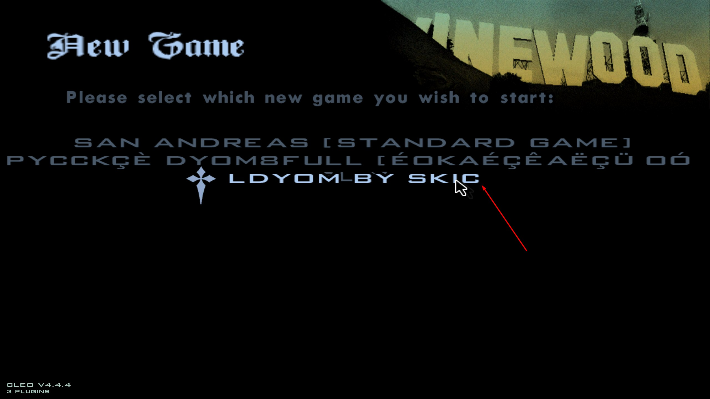
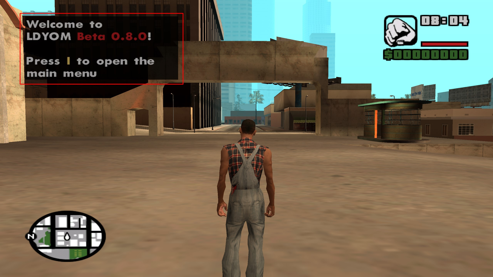

The instructions are intended for version <ins>Beta 0.8+</ins>.

To begin with, it is preferable to have a clean Grand Theft Auto: San Andreas version **1.0 (Hoodlum)**.
As the modification has not been tested with other mods at the moment.

Next, you will need to install any ASI Loader. If you already have CLEO installed, then most likely you already have
Silent's ASI Loader installed. In general, it will suffice, but I recommend
replacing it with [Ultimate ASI Loader](https://github.com/ThirteenAG/Ultimate-ASI-Loader/releases).

    
How to replace Silent's ASI Loader with Ultimate ASI Loader

    1. Download `vorbisFile.dll` from the [Ultimate ASI
    Loader](https://github.com/ThirteenAG/Ultimate-ASI-Loader/releases) download page.
    2. Move to the game folder replacing the existing file.

After that, install [CLEO 4.3+](https://cleo.li/) following the official instructions, excluding `vorbisHooked.dll`
and `vorbisFile.dll` if you already have one of the ASI Loaders installed.

Next, download the latest version of the modification from the [download page](/download).
1. From the `In GTA` folder, copy all files to the game folder.
2. Place the `MPACK` folder in `..\Documents\GTA San Andreas User Files`.
3. Optionally, you can also copy files from the `In GTA (Optional)` folder to the game folder.
These are auxiliary modifications: [Visual Player Image](https://libertycity.net/files/gta-san-andreas/107635-visual-player-image-v1.0.html)
and [Interior Teleport Menu (edited for LDYOM)](https://libertycity.net/files/gta-san-andreas/126311-teleport-v-zdanija.html).
More details about them can be found on their respective pages.

It's worth noting that the modification also requires [DirectX9](https://www.microsoft.com/en-us/download/details.aspx?id=8109)
and [Microsoft Visual C++ 2015-2019 Redistributable x86](https://learn.microsoft.com/en-US/cpp/windows/latest-supported-vc-redist?view=msvc-170)
to be installed. In most cases, they are already installed, but it's advisable to check.

After installing the modification, launch the game and check if the modification is working.

    
    Game selection menu

    
    Welcome window of the modification

If you encounter any problems, please contact the [official Discord server](https://discord.gg/4KGf4Px) or
the [official Telegram channel](https://t.me/ldyom).

