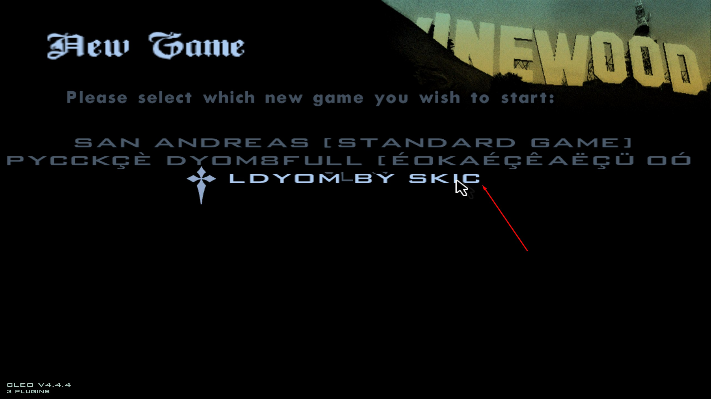
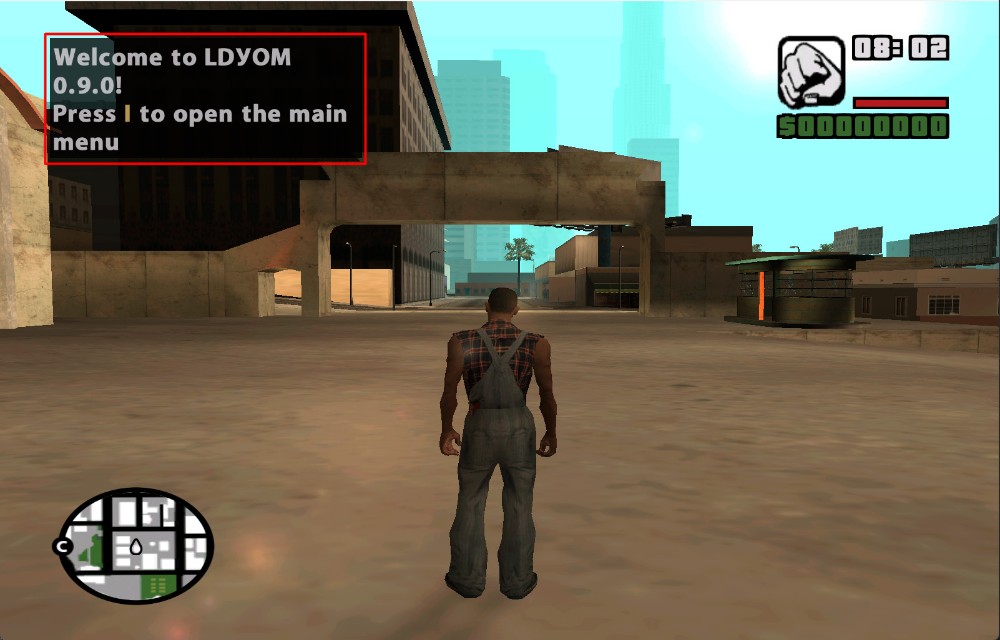

import Tabs from '@theme/Tabs';
import TabItem from '@theme/TabItem';

The instructions are intended for version <ins>Beta 0.9+</ins>.

## Requirements

- Grand Theft Auto: San Andreas **1.0 (Hoodlum)** — a clean installation is strongly recommended, as the modification has not been tested with other mods.
- [DirectX 9](https://www.microsoft.com/en-us/download/details.aspx?id=8109)
- [Microsoft Visual C++ 2015–2019 Redistributable x86](https://learn.microsoft.com/en-US/cpp/windows/latest-supported-vc-redist?view=msvc-170)

In most cases DirectX 9 and Visual C++ are already installed, but it's advisable to verify.

## Step 1 — Remove old LDYOM files

:::warning Incompatible with previous versions
Files from LDYOM **0.7.x** and **0.8.x** are **not compatible** with Beta 0.9+.
If you have a previous version installed, remove the following files from your GTA San Andreas folder before proceeding:

- `LDYOM.asi`
- `LDYOM\` folder
:::

## Step 2 — Install ASI Loader

You will need an ASI Loader to run `.asi` plugins. If you already have CLEO installed, Silent's ASI Loader is likely already present. However, it is recommended to use [Ultimate ASI Loader](https://github.com/ThirteenAG/Ultimate-ASI-Loader/releases) instead.

    
How to replace Silent's ASI Loader with Ultimate ASI Loader

    1. Download `vorbisFile.dll` from the [Ultimate ASI Loader](https://github.com/ThirteenAG/Ultimate-ASI-Loader/releases) releases page.
    2. Move it to the game folder, replacing the existing file.

## Step 3 — Install CLEO

Install [CLEO 5.4+](https://cleo.li/) following the official instructions. If you already have an ASI Loader installed, skip copying `vorbisHooked.dll` and `vorbisFile.dll`.

## Step 4 — Install LDYOM

Download the latest version of the modification from the [download page](/download), then:

1. Copy all files from the `In GTA` folder into your GTA San Andreas game folder.
2. Place the `MPACK` folder in `Documents\GTA San Andreas User Files`.
3. Optionally, copy files from the `In GTA (Optional)` folder to the game folder.
These are auxiliary modifications: [Visual Player Image](https://libertycity.net/files/gta-san-andreas/107635-visual-player-image-v1.0.html)
and [Interior Teleport Menu](https://libertycity.net/files/gta-san-andreas/126311-teleport-v-zdanija.html).
More details about them can be found on their respective pages.

## Step 5 — Launch the game

After installing, launch GTA San Andreas and verify the modification is working correctly.

    
    Game selection menu

    
    Welcome window of the modification

## Troubleshooting

If you encounter any problems, please reach out via:
- [Official Discord server](https://discord.gg/4KGf4Px)
- [Official Telegram channel](https://t.me/ldyom)
